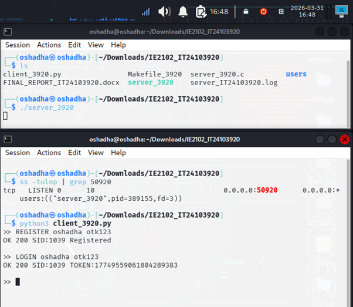
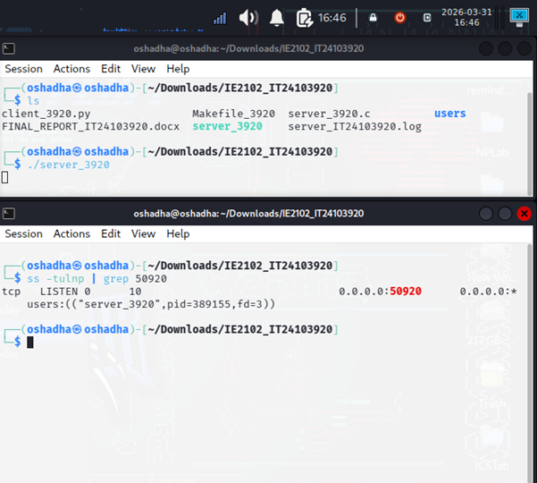
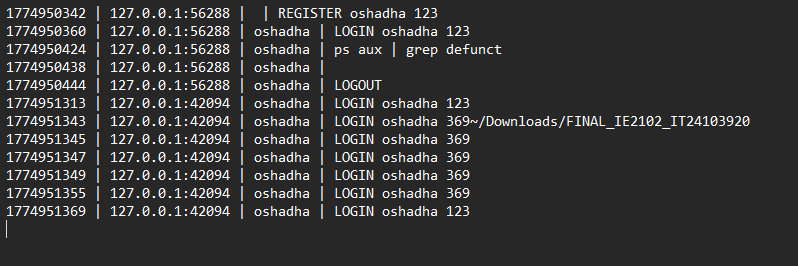

# 🔐 TCP Authentication Server (C + Python)


This project is a **secure multi-process TCP authentication server** developed for the *IE2102 Network Programming* module.

It demonstrates **socket programming, process management, and security concepts** using C and Python.

---

## 🚀 Features

- Multi-client handling using `fork()`
- Custom TCP protocol (length-prefixed)
- User registration & login system
- Password hashing (secure authentication)
- Brute-force protection (account lock after 3 attempts)
- Audit logging (timestamp, IP, command tracking)
- Proper child process cleanup (no zombie processes)

---

## 🛠 Technologies

- C (Server)
- Python (Client)
- TCP Sockets
- Linux System Programming

---
## 📸 Screenshots

### 🔹 Register & Login
<p align="center">
  
</p>

### 🔹 Server Running (Port Listening)
<p align="center">
  
</p>

### 🔹 Audit Log Output
<p align="center">
  
</p>
---

## ⚙️ How to Run

### 🔹 Compile Server
```bash
gcc server_3920.c -o server
./server

